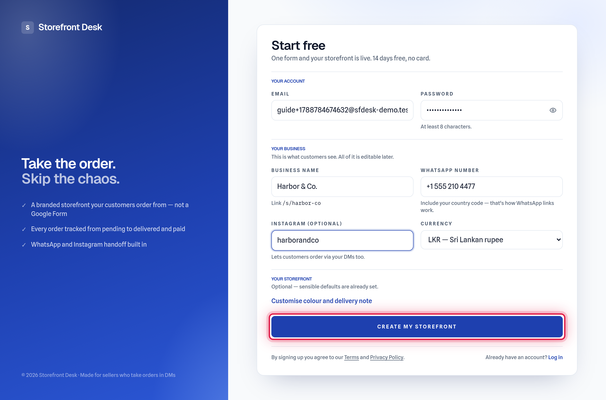
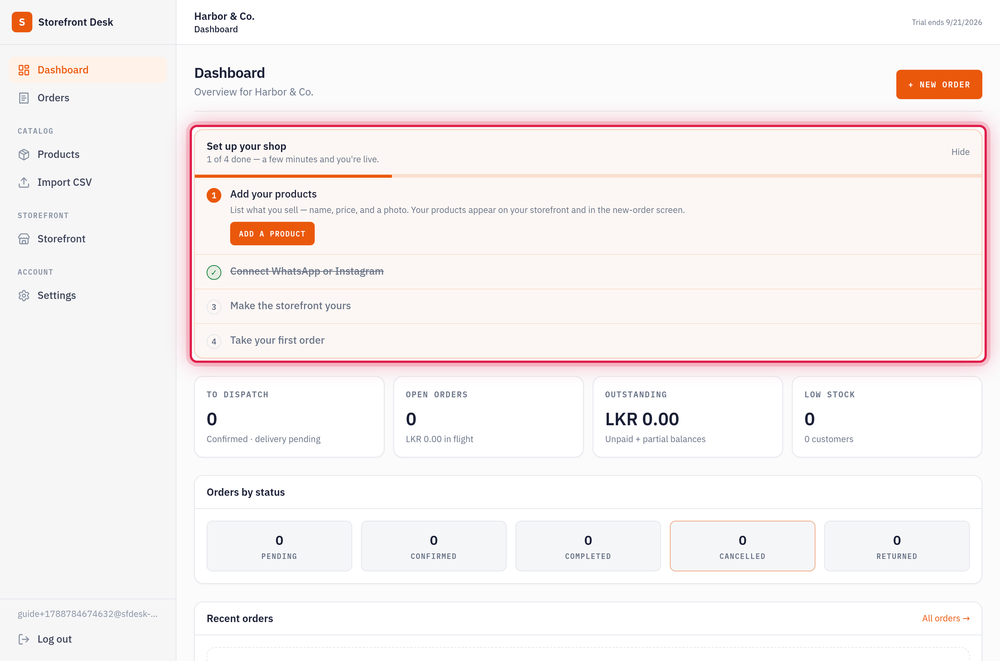
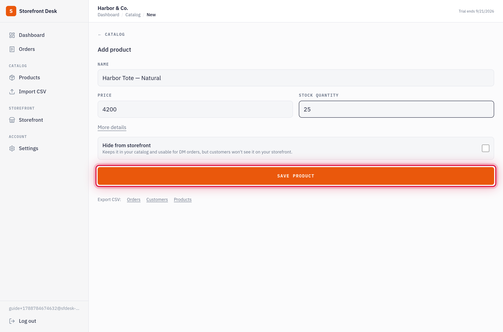
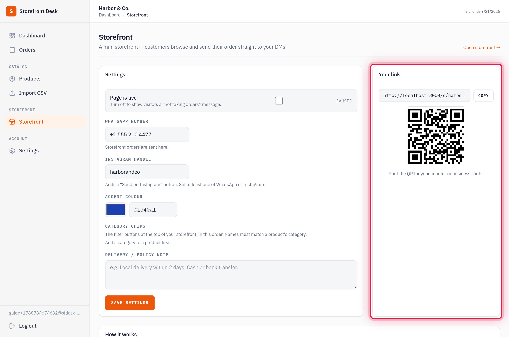
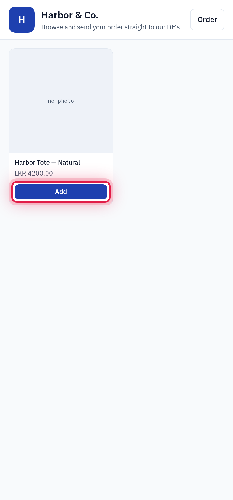
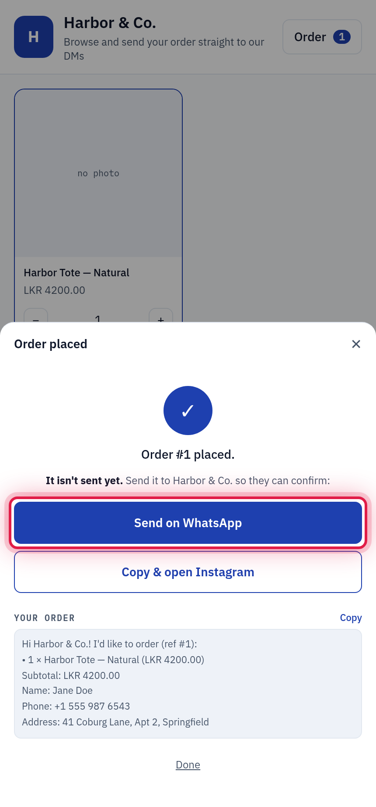
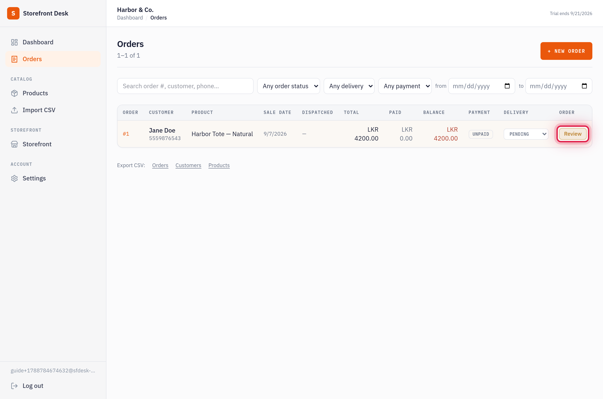
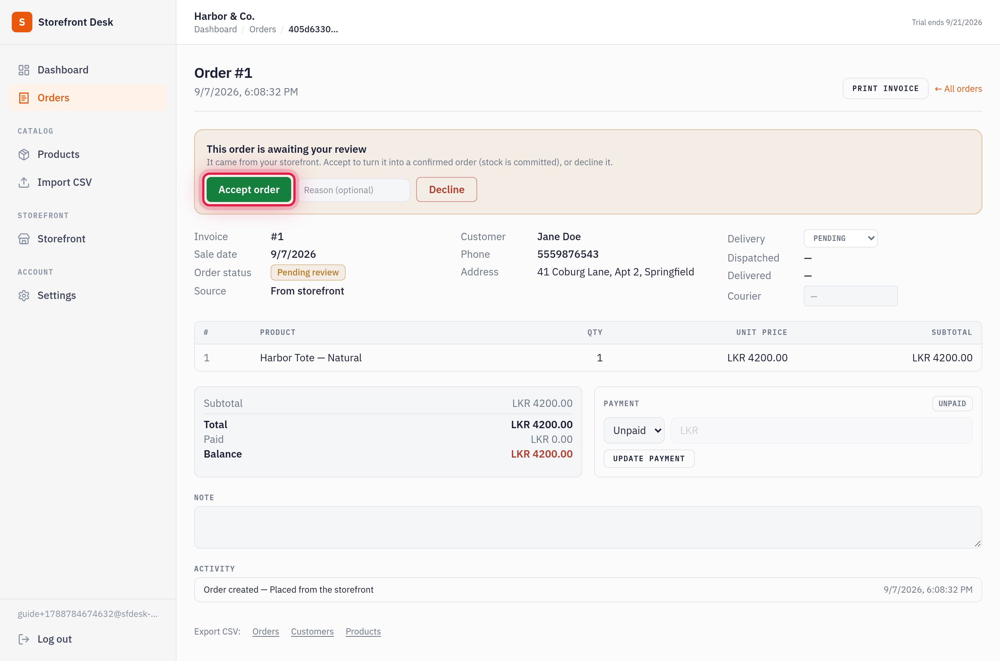

# Getting started with Storefront Desk

Storefront Desk gives you two things:

- **A mini storefront** — a link your customers open to browse your products and build an order.
- **An order desk** — where every order lands so you can track it from pending → delivered → paid, without scrolling back through chats.

This guide walks you from sign-up to accepting your first order. It takes about five minutes.

---

## 1. Create your account

Go to the sign-up page and fill in one short form:

| Field | What it's for |
| --- | --- |
| **Email + password** | Your login. |
| **Business name** | Shown to customers. It also becomes your storefront address (`/s/your-shop`) — you can change this later in Settings. |
| **WhatsApp number** | Where storefront orders are sent. Include the country code (e.g. `+1 555 210 4477`). |
| **Instagram handle** | Optional. Adds a "Send on Instagram" option for customers. |
| **Currency** | The currency shown across your storefront and desk. |

You can expand **Customise colour and delivery note** now or skip it — sensible defaults are already set.

Click **Create my storefront**. Your account and storefront are created together, and you land straight in the desk.

---

## 2. Find your way around the dashboard

The dashboard is your home base.

- **Set up your shop** — a checklist that walks you through the remaining steps. Work through it top to bottom.
- **Stat tiles** — to dispatch, open orders, outstanding balance, low stock. Click any tile to jump to a filtered list.
- **Left sidebar** — Dashboard, Orders, Products, Storefront, Settings.
- **+ New order** (top right) — add an order by hand, for a sale that didn't come through the storefront.

---

## 3. Add your first product

From the checklist, click **Add a product** (or **Products → Add** in the sidebar).

Only two fields are required:

- **Name**
- **Price**

Add a **stock quantity** if you want the app to track inventory, or open **More details** for a description, category, photo, and SKU. A photo is optional but makes your storefront look far better.

Click **Save product**. Repeat for the rest of your catalog, or import many at once with **Import CSV**.

---

## 4. Share your storefront

Open **Storefront** in the sidebar. On the right you'll find **Your link** and a **QR code**.

- **Copy the link** into your Instagram bio, WhatsApp status, story highlights, or email signature.
- **Print the QR code** for your counter, packaging, or business cards.

On the left, the **Settings** panel controls how your storefront looks and behaves — accent colour, category filter chips, a delivery/payment note, and a switch to pause the page when you're not taking orders.

---

## 5. What your customer sees

When someone opens your link, they get a clean, branded shop on their phone — your products, your colour, your delivery terms.

They tap **Add** on the items they want, adjust quantities, and open their order.

---

## 6. The customer sends you the order

After picking items, the customer enters their name, phone, and delivery address, then confirms.

They see an **Order placed** screen with a **Send on WhatsApp** button (and **Send on Instagram**, if you set a handle). Tapping it opens the chat with the full order pre-filled — the customer just hits send.

> The order is only sent once the customer taps that button. The full order text is also shown on screen so they can copy it manually if anything goes wrong.

---

## 7. The order lands in your desk

Every storefront order appears in **Orders** — and on your dashboard — marked **Pending**. You'll also get an email for each new order.

Pending rows are tinted and show a **Review** button instead of the usual status controls.

---

## 8. Accept (or decline) the order

Open the order. A banner at the top lets you:

- **Accept order** — turns it into a confirmed order and commits the stock. From here you track delivery and payment as normal.
- **Decline** — with an optional reason.

Once accepted, use the **Delivery** and **Payment** controls to move the order through dispatch and mark it paid. That's the full loop.

---

## What's next

- **Orders** — search, filter by status, and page through your history. Export to CSV any time.
- **Settings** — change your business name, storefront address, currency, default delivery fee, and password.
- **Dashboard tiles** — your daily check: what's to dispatch, what's owed, what's low on stock.

Your storefront is live from the moment you add a product. Share the link and take your first real order.
